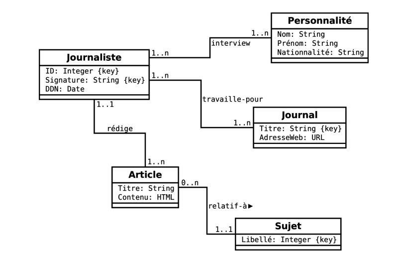
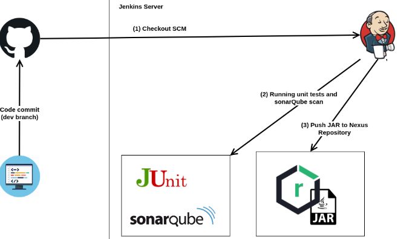

# Spring Devops project
## Description of the project

This project is created to test the process of a **CI/CD pipeline** using **Jenkins**.

We don't really care about the content of the application more than about the process that our application will go through.
Our application is a simple pet store where we have the owners and their pets.

<p align="center">
  
</p>

The process of our pipeline will follow these steps :
* Running the unit tests and scanning the code using the sonarQube
* Building an artifact (JAR in our case) and pushing it to a Nexus repository

<p align="center">
  
</p>

## Test the application locally
* First thing to do after cloning the application is open it with an IDE and specifying that it's a maven project in order to check for the required dependencies ( used packages ) in the POM.xml file.
* Launch mysql database 
* Once the database  is launched, we can run our application ( the database configuration for our app can be found in application.properties file)
* To run the application unit tests, we run the command
```
mvn test
```


